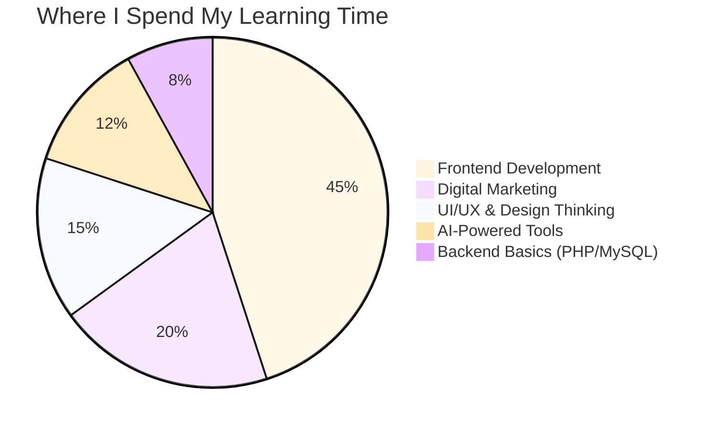
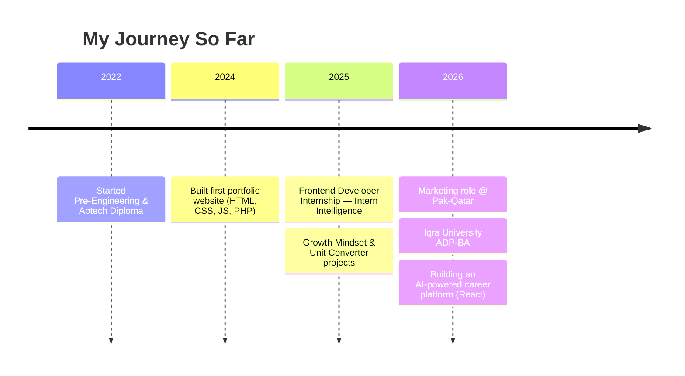

<!-- =========================================================
     MUHAMMAD HASNAIN — GITHUB PROFILE README
     Repo: hasnainabdi/hasnainabdi  (must match your username)
     ========================================================= -->

<!-- PUT YOUR COVER PHOTO HERE — replace cover.png below -->
<p align="center">
  
</p>

<p align="center">
  
</p>

<h1 align="center">
  
  Hi, I'm Muhammad Hasnain
</h1>
<h3 align="center">Frontend Developer | Software Engineering Student | Digital Marketer</h3>

<p align="center">
  
</p>

<p align="center">
  <a href="https://hasnainabdi.space-z.ai"></a>
  <a href="https://www.linkedin.com/in/m-hasnain-abdi"></a>
  <a href="https://codeandhustle.blogspot.com"></a>
  <a href="https://x.com/smhasnainabdi"></a>
  <a href="https://www.facebook.com/shasnainabdi"></a>
  <a href="mailto:m.hasnainreactions@gmail.com"></a>
</p>

<p align="center">
  
  
  
</p>

---

###  About Me

```yaml
name: "Muhammad Hasnain"
role: "Frontend Developer & Digital Marketer"
education: "Software Engineering Diploma @ Aptech | ADP-BA @ Iqra University"
location: "Karachi, Pakistan"
currently_learning: ["AI-driven web development", "Advanced React patterns"]
languages: ["English", "Urdu"]
motto: "Passionate about Technology. Focused on Growth. Committed to Impact."
```

-  Currently studying **Software Engineering** at Aptech Learning Institute (Aug 2022 – May 2026)
-  Pursuing an **Associate Degree in Business Administration** at Iqra University
-  Working in **Marketing** at Pak-Qatar, alongside hands-on frontend development
-  Growing into **AI-powered web development** and modern React practices
-  I build **portfolio-ready, real-world web products** — not just tutorials
-  Reach me at **m.hasnainreactions@gmail.com**

<p align="center">
  
</p>

---

###  Tech Stack & Tools

<p align="center">
  
</p>

<p align="center">
  
</p>

<table align="center">
<tr>
<td valign="top" width="33%">

**Frontend**
- HTML5, CSS3, JavaScript
- React.js, Bootstrap
- Responsive Web Design

</td>
<td valign="top" width="33%">

**Tools & Platforms**
- VS Code, Git, GitHub
- Streamlit
- MS Office, Google Workspace

</td>
<td valign="top" width="33%">

**Digital Marketing**
- SEO, Google Ads, Meta Ads, GA4
- Lead Generation & Client Handling
- Google Business Profile

</td>
</tr>
</table>

---

###  My Skill Focus





---

###  Featured Projects

<p align="center">
  
</p>

| Project | Description | Tech Stack |
|---|---|---|
| **[Portfolio Website](https://hasnainabdi.space-z.ai)** | Personal portfolio showcasing projects, skills & resume — PWA-enabled with dark/light mode and EmailJS contact form | HTML, CSS, JS, PHP |
| **Growth Mindset Challenge** | Web app that helps users build daily habits through structured challenges, self-reflection and motivational content | HTML, CSS, JS |
| **Unit Converter** | Real-time converter for length, weight & temperature with a clean, fast UI | Streamlit, Python |
| **Bulk Up Pro** | Interactive fitness app with diet & workout tracking, Pakistani recipes, calculators, and PDF export | HTML, CSS, JS |
| **HarKaam** | Home services marketplace concept connecting customers with trade workers in Pakistan | HTML, CSS, JS |
| **Sun Rise Man Salon** | Luxury barbershop booking site with a dark/gold aesthetic and 3-step booking flow | React.js |
| **EduMind AI** | AI-powered student learning platform concept with a React frontend prototype | React, PHP, MySQL (planned) |
| **AI Career Platform** | React prototype exploring AI-guided career discovery tools | React.js |

>  Full write-ups and behind-the-scenes on my [blog](https://codeandhustle.blogspot.com).

---

###  Experience Snapshot

<table align="center">
<tr><th>Role</th><th>Organization</th><th>Duration</th></tr>
<tr><td>Frontend Developer Intern</td><td>Intern Intelligence</td><td>Feb 2025 – Mar 2025</td></tr>
</table>

**Key wins:**
-  Developed & maintained 5+ responsive web pages, improving UI consistency
-  Achieved a 100% task completion rate collaborating with cross-functional teams
-  Managed 20+ daily customer interactions and structured lead-tracking in Excel
-  Promoted services via SEO, Google Ads, Meta Ads and word-of-mouth strategy

---

###  GitHub Stats

<p align="center">
  
</p>

<p align="center">
  
  
</p>

<p align="center">
  
</p>

<p align="center">
  
</p>

<!-- Contribution snake — needs a one-time GitHub Action setup, see notes below -->
<p align="center">
  
</p>

---

###  Certifications

- Full Stack React E-Commerce Project — GreatStack
- AI-Powered Digital Advertising: Google Ads, Meta Ads & GA4 — Udemy
- Become an AI-Powered Marketer — SEMrush
- Career Essentials in Generative AI — Microsoft & LinkedIn

>  All certificates verified on [LinkedIn](https://www.linkedin.com/in/m-hasnain-abdi)

---

###  Let's Connect

<p align="center">
  <a href="https://hasnainabdi.space-z.ai"></a>
  <a href="https://www.linkedin.com/in/m-hasnain-abdi"></a>
  <a href="mailto:m.hasnainreactions@gmail.com"></a>
</p>

<p align="center"><i> Passionate about Technology. Focused on Growth. Committed to Impact.</i></p>

<p align="center">
  
</p>
